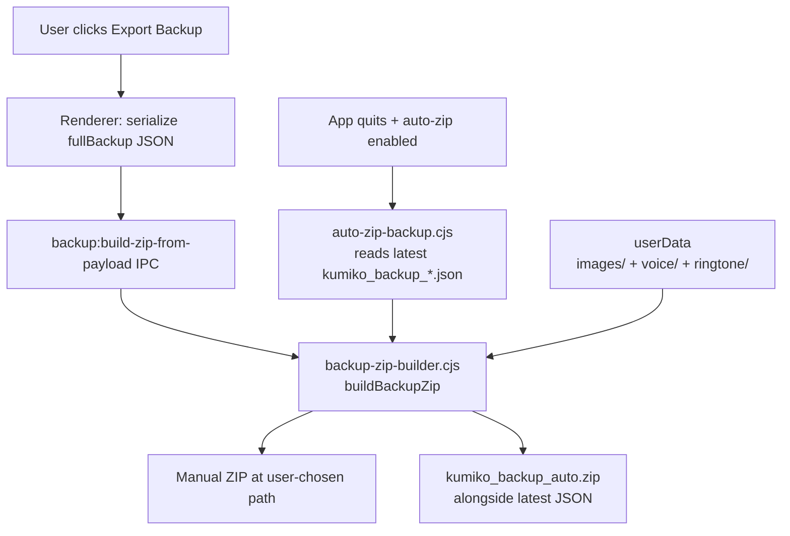

# Backup Architecture

This note documents how Kumiko·Amadeus moves user data in and out of disk as
backups. It is the source of truth for anyone touching the `backup:*` IPC
surface, `data.json` schema, or the auto-zip / manual-export flows.

Scope: backup only. RAG vector store / SQLite message mirror is separate —
see [rag-architecture.md](./rag-architecture.md).

## Two entry points, one builder

Before Plan 14 Phase B there were two independent zip assemblers (renderer
JSZip for manual exports, main-process JSZip for quit-time auto-backups).
Post-Plan 14 both routes converge on [`electron/backup-zip-builder.cjs`]
in the main process; `userData/images|voice|ringtone` is the authoritative
source of media content on desktop.



The renderer branch only kicks in on web / PWA builds (no `window.electronAPI`),
where the Dexie `ImageEntity` rows are the only readable image source. On
Electron desktop the renderer call to `buildDesktopBackupZip` is a thin IPC
wrapper — no renderer-side JSZip runs.

## Contracts

### `buildBackupZip` (main process helper)

Input:

- `dataJsonString` — already-serialized JSON. Caller owns worldBook
  sanitization and any other payload shaping.
- `mode` — `'manual'` or `'auto'`.
  - `'manual'`: `dataJsonString` is written verbatim.
  - `'auto'`: re-parsed, stamped with `_autoZipMeta`, re-serialized. If
    parsing fails we fall back to writing raw bytes untouched — the core
    backup is never lost to a cosmetic metadata patch.
- `outputPath` — absolute destination path. Caller is responsible for
  having the user approve the path (auto path uses
  `dirname(latestJson)/kumiko_backup_auto.zip`; manual path uses the
  native save dialog in `backup-ipc.cjs`).
- `userDataDir` — optional override (test seam).

Output: `{ success, bytesWritten, imagesIncluded, imagesTotal, autoZipMeta?, error? }`.

### `backup:build-zip-from-payload` (IPC)

Renderer → main. Payload `{ dataJsonString, defaultFileName? }`. Main drives
the native save dialog internally; renderer never sees a file path. Returns
`{ canceled: true }` on dialog dismissal, `{ success, outputPath, ... }`
on write, `{ success: false, error }` on builder failure.

This is the only write-oriented backup IPC that does not live in the
`backup:pick-save-file` → `backup:write-file` two-step pattern, because a
zip needs binary writes the renderer can't cheaply serialize across IPC.

### Import-side contracts

- `backup:pick-open-file` — native open dialog, authorizes the chosen path.
- `backup:read-file` — returns the file contents as a string. Only
  authorized paths are allowed (see [`authorized-paths.cjs`]).
- `backup:parse-import-file` — parses a ZIP or JSON backup into a
  restore-ready payload. For ZIPs it unpacks `voice/` and `ringtone/` into
  `userData/voice/` and `userData/ringtone/` respectively; images come back
  in the return value as base64 data URLs for the renderer to persist via
  `imageService.saveImageWithId`.

## data.json schema

```
{
  timestamp: number,        // epoch ms when the JSON was serialized
  version: '1.3',           // bumped when the shape changes
  data: {
    messages: Message[],
    coreMemory: string,
    worldBook: Partial<WorldBookEntry>[],
    contextLimit: number,
    turnCount: number,
    summaryArchiveState: SummaryArchiveState,
    currentEmotion: EmotionType,
    locationConfig: LocationConfig,
    language: Language,
    anchors: AnchorEntry[],
    kumikoNotebook: string,
    relativeReminders: RelativeReminderBackup[],
    dailyReminders: DailyReminderBackup[],
    worldCharacterStatus?: WorldCharacterStatusMap
  },
  vectors?: ...             // RAG snapshot; see rag-architecture.md
  kumikoDiary?: KumikoDiaryEntity[],
  dailyFragments?: DailyFragmentEntity[],
  psycheState?: PsycheStateEntity | null,
  episodes?: EpisodeEntity[],
  _autoZipMeta?: AutoZipMeta // stamped by auto path only (see below)
}
```

`handleExportBackup` moves `kumikoDiary` / `dailyFragments` / `psycheState`
out of `data` into the top level; `normalizeBackupData` on the import side
handles either shape. Legacy backups before this split keep the same
`.data.{kumikoDiary,...}` layout and still restore correctly.

## `_autoZipMeta`: degraded-auto-backup marker

Stamped into the root of `data.json` (not inside `data`) by the auto-zip
before-quit flow. Absent on manual exports and on any backup created before
the Plan 2 feature shipped — absence means "assume fully complete", which
matches historical behaviour.

```typescript
interface AutoZipMeta {
  autoZipGeneratedAt: string;      // ISO timestamp
  hasImages: boolean;              // imagesIncludedCount > 0
  imagesIncludedCount: number;
  imagesTotalCount: number;
  imagesErrorReason?: string;      // filled when fs.readdirSync threw
}
```

Import-side handling in [`components/app/backupActions.ts`]:
`parseDesktopBackupImportFile` reads it and surfaces a non-blocking toast
if `hasImages === false` or `imagesIncludedCount < imagesTotalCount`. The
restore proceeds anyway — partial data is better than no data.

## Legacy inline image hydrate (Plan 14 Phase A exit)

Pre-Plan-14 backups could contain `message.image` as an inline base64 data
URL (the legacy shape before `imageId` + `userData/images/{id}.{ext}` was
introduced). Phase A removed the DB field entirely, but legacy JSON
backups still exist on disk and can be re-imported.

On import, `handleImportBackup` runs a single hydration pass
([`components/app/backupActions.ts`] around the `legacyInlineMessages`
filter) that converts every surviving inline image into an `imageId`
reference. Failure on one row drops that image entirely — we don't keep
the inline field alive past import because that reintroduces the exact
dual-shape problem Phase A closed.

## Legacy auto-zip filename fallback

Auto-zips created before Plan 1 P0 #1 stored the JSON as
`kumiko_backup.json` instead of `data.json`. Both import paths
([`components/app/backupActions.ts`] for manual file-picker imports,
[`electron/backup-files.cjs`] for desktop IPC imports) check
`data.json` first, fall back to `kumiko_backup.json`, and log a warn
recommending a re-export. New auto-zips always write `data.json`.

## Authorization model

Every main-process write / read goes through `assertBackupPathAllowed` in
[`electron/backup-files.cjs`]. A path is allowed if:

1. It is inside `app.getPath('userData')`, or
2. It was picked in this session via `backup:pick-save-file` /
   `backup:pick-open-file` (or the newer `backup:build-zip-from-payload`
   save dialog, which calls `authorizeBackupPath` internally).

The authorized-paths set persists across restarts so a compromised renderer
cannot redirect backup IO to arbitrary disk locations.

## Non-desktop fallback

`window.electronAPI` is absent on web / PWA deployments. In that case:

- Manual export falls through to `buildWebBackupZipBlob` in
  [`components/app/backupActions.ts`], which runs the legacy renderer
  JSZip path: images from Dexie `ImageEntity.base64Data`, voice /
  ringtone via `voiceFileService` fallbacks, `saveAs` to trigger a browser
  download.
- No auto-zip (no `before-quit`).
- No native save dialog (file-saver's download-prompt semantics only).

This fallback is retained because `index.tsx` still registers the PWA
service worker and the web-build target is not formally retired. Both paths
produce the same ZIP layout; drift between them has to be kept in sync
manually if any future change touches media folders.
