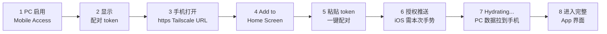
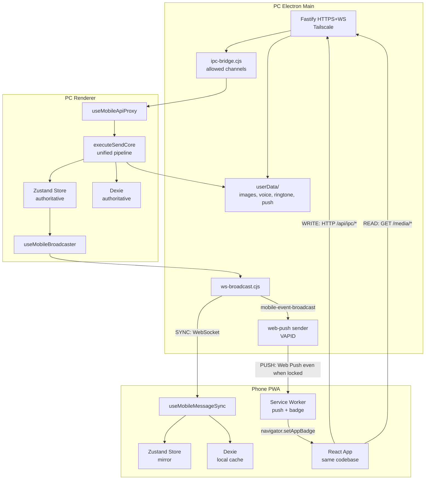
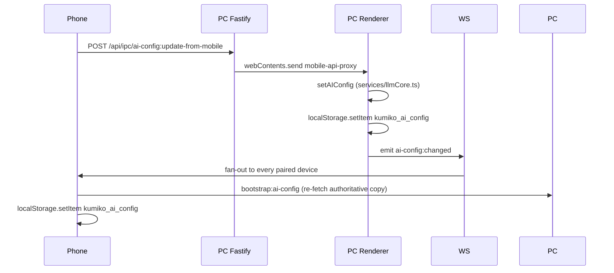
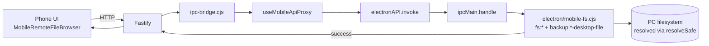

# 手机端功能与数据一致性参考 (Mobile Parity Reference)

本文是 Kumiko·Amadeus 手机端（PWA）的 **功能与数据层面** 的参考手册。
Phase 1–5 全部交付完成后，这份文档回答两个问题：

1. **用户角度**：手机端到底能做什么？有没有做不到的？
2. **维护者角度**：每一条数据、每一个文件是怎么从桌面流到手机上、或者反过来的？

与其它手机相关文档的分工：

| 文档 | 主题 |
|------|------|
| [mobile-remote-access.md](./mobile-remote-access.md) | 传输层架构：Fastify / WebSocket / Tailscale / cookie / 配对协议 |
| [mobile-setup-guide.md](./mobile-setup-guide.md) | 终端用户安装教程：Tailscale 怎么装、手机怎么连 |
| **本文件** | **功能全量对照、文件管理、数据流全景、物理限制** |

底层实现细节请去 [mobile-remote-access.md](./mobile-remote-access.md) 和
[backup-architecture.md](./backup-architecture.md) / [rag-architecture.md](./rag-architecture.md)
查看，本文只在必要时链过去。

---

## 1. 部署模型（一句话复述）

每个用户 1 台开着的 PC + N 台自己的手机。PC 跑桌面 Electron 进程，同时以
Fastify HTTPS + WebSocket 暴露给 Tailscale 私网内的手机。手机是 PWA（浏览器
"添加到主屏幕"后的应用），不存任何 API Key 和多媒体原文件，全部从 PC 拉。

**前提假设**：

- PC 开着（睡眠 / 关机则手机离线，这是设计承诺的约束）。
- 两台设备都在同一个 Tailscale 账号下，或者至少在同一 tailnet。
- LLM 调用本来就要联网，所以 "PC 无网 = 手机无网" 不算新约束。

---

## 2. 手机端使用流程

一次配置，之后无感。



**各步骤对应代码**：

1. PC 侧设置面板 → Mobile Access → 启动服务。
   入口：[electron/server/fastify-server.cjs](../electron/server/fastify-server.cjs) 的 `start()`。
2. PC Toast 上显示一次性 token（详见 [mobile-remote-access.md](./mobile-remote-access.md)）。
3. 手机浏览器访问 `https://<Tailscale MagicDNS>:<port>/`。@fastify/static
   返回 PWA 的 `dist/index.html`。
4. iOS Safari → 分享 → 添加到主屏幕；Android Chrome → 菜单 → 安装。
   manifest 配置在 [vite.config.ts](../vite.config.ts)。
5. 手机粘贴 token，[components/MobilePairingGate.tsx](../components/MobilePairingGate.tsx)
   发 `POST /api/auth/pair`，PC 下发 HttpOnly session cookie。
6. 配对成功那一瞬间（iOS 16.4+ 强制要用户手势）立刻 `ensurePushSubscription()`
   申请通知权限并 `pushManager.subscribe()`。
   实现在 [services/pushSubscriptionService.ts](../services/pushSubscriptionService.ts)。
7. `MobilePairingGate` 依次调 `bootstrap:ai-config`（拉 API Key / TTS 配置 /
   主题到 `localStorage`）+ `bootstrap:snapshot`（PC Dexie 全量表拉到手机本地
   IndexedDB），期间显示 `HydratingView`。`sessionStorage` 打标避免同一会话
   重复 hydrate。
8. 进入 `<App />`——**和桌面同一份 React 代码**。
   **Phase 6 起不再跳过** INTRO / AUTH / CONFIG：手机首次进入会依次走
   品牌启动页 → LOGIN（Kumiko/0821）→ SETUP（LOCAL 用新的远程文件浏览器、
   MANUAL 用 `POST /api/backup/import`）→ CONFIG（AI 配置直接把变更写回 PC），
   之后和桌面一样通过 `initialFlowState` + `backupConfig` 持久化，有效配置存在时
   再启动直接跳到 APP。详见下文第 9 节 "Phase 6 全面统一桌面流程"。

---

## 3. 功能全量对照矩阵

"一致"表示该功能在手机端完全可用，UI 与交互与 PC 等价；"概念不存在"表示该
操作在手机这个设备形态下没有意义，不是删减。

### 3.1 聊天与消息

| 功能 | 状态 | 实现路径 |
|------|------|---------|
| 文字消息发送 | 一致 | 手机调 [components/app/mobileChatSend.ts](../components/app/mobileChatSend.ts) → `POST /api/ipc/chat` → PC `executeSendCore` |
| LLM 调用（Gemini / OpenAI 等） | 一致 | **全部在 PC 执行**，手机只按按钮 |
| 消息实时到达 | 一致 | [components/app/useMobileBroadcaster.ts](../components/app/useMobileBroadcaster.ts) → WebSocket → [components/app/useMobileMessageSync.ts](../components/app/useMobileMessageSync.ts) |
| 长按 / 右键菜单 | 一致 | [hooks/useLongPress.ts](../hooks/useLongPress.ts) |
| 编辑 / 复制 / 删除 / 隐藏 / 置顶 / 引用 / 重发 | 一致 | `ChatBubble` + Zustand actions |
| 图片发送 | 一致 | 手机 base64 上传 → PC `images:save` 落 `userData/images/` |
| 图片查看（pinch / swipe） | 一致 | Framer Motion 在 `ImageViewer` |
| 语音消息播放 | 一致 | `<audio src="/media/voices/:id">` 流式 |
| 语音消息生成（SoVITS 合成的 Kumiko 回复） | 一致 | PC 合成 → 广播 → 手机播放 |
| 中日双语显示、日文原文切换 | 一致 | 同一 React 组件 |

### 3.2 记忆 / 心态 / 日记

| 功能 | 状态 | 说明 |
|------|------|------|
| RAG 搜索 | 一致 | `rag:search` 在 [services/httpApi.ts](../services/httpApi.ts) 的 `PWA_ALLOWED_CHANNELS` |
| RAG 重建 | 一致 | `rag:rebuild:start` + `rag:rebuild:*` 进度事件通过 WS 桥接到手机 |
| RAG 嵌入 / 清空 / 同步 / 恢复 | 一致 | IPC 白名单全部开放 |
| Life Stream 自动生成 | 一致 | PC 后台线程，消息同步到手机 |
| Diary 日记回填与校验 | 一致 | `DiaryPanel` / `DiaryBackfillDialog` 直接由 `<App />` 渲染 |
| 心态状态（情绪 / 紧张度等） | 一致 | `status:emotion` WS 广播 |
| 总结 / 记忆归档 | 一致 | `executeSendCore` 内部触发，手机零感知 |

### 3.3 语音（GPT-SoVITS）

| 功能 | 状态 | 说明 |
|------|------|------|
| SoVITS 本地 Python 后端运行 | PC 承担物理执行 | Python + CUDA 事实要求 |
| 手机查看 / 控制 Genie 状态 | 一致 | `genie:status` / `genie:start` / `genie:stop` 白名单 |
| 手机配置 SoVITS Python 路径 | 一致 | `genie:test-sovits-python` 接收手机传入路径，PC 验证后返回 |
| Genie 生命周期通知 | 一致 | `genie:status-changed` 通过 WS 桥接 |
| 合成出的语音 MP3 | 一致 | 写入 `userData/voice/`，手机 HTTP 流播放 |

### 3.4 来电 / 铃声 / 提醒

| 功能 | 状态 | 说明 |
|------|------|------|
| 来电全屏 UI | 一致 | [components/VoiceCallOverlay.tsx](../components/VoiceCallOverlay.tsx) + `call:state` WS 广播 |
| 接听 / 拒听 / 关闭 | 一致 | 手机按钮 → `POST /api/ipc/call:action` → PC 调真实闭包 |
| 自定义铃声播放 | 一致 | `GET /media/ringtone`（Phase 5D 新增） |
| 内置铃声 01–08 | 一致 | `/ringtones/0X.mp3` 静态 |
| Kumiko 语音回放 | 一致 | `voiceFileId` 广播到手机 → `<audio src="/media/voices/:id">` |
| 锁屏 / App 被杀时收到来电 | 一致 | Web Push 推 `type: 'call'` 带 `requireInteraction + vibrate` |

### 3.5 推送与徽章（Phase 5 A+B）

| 场景 | 手机响应 |
|------|---------|
| PC 收到 Kumiko 新消息 | Web Push → 锁屏通知 + 徽章 +1 |
| 来电第一响 | Web Push → requireInteraction 横幅 + 震动 |
| 阅读清零 | 静默推送清零徽章 |
| 前台运行中未读变化 | `navigator.setAppBadge(count)` 实时更新 |

VAPID 密钥持久化：`userData/push/vapid.json`。
订阅列表：`userData/push/subscriptions.json`（410 Gone 自动清理）。
实现：[electron/server/push-notifications.cjs](../electron/server/push-notifications.cjs)。

### 3.6 备份 / 恢复

| 功能 | 状态 | 说明 |
|------|------|------|
| 手动导出 ZIP | 一致 | `POST /api/backup/export` → PC 内存打包 → 流式下载 → 手机 `file-saver` |
| 手动导入 ZIP / JSON | 一致 | 手机 `<input type="file">` 取字节 → `POST /api/backup/import` → PC 解包 → WS 广播 |
| 自动备份进度 | 一致 | `app:auto-zip-progress` 通过 WS 实时到手机 Toast |
| 备份文件保存到用户选择位置 | 一致 | 手机走浏览器下载对话框（系统原生） |
| AuthScreen / SettingsPanel 的 LOCAL 备份槽 | **Phase 6 打通** | 手机通过 [components/MobileRemoteFileBrowser.tsx](../components/MobileRemoteFileBrowser.tsx) 浏览 PC 的 `mobileBrowseRoot`，选中 / 新建的 `.json` 文件直接由 `backup:read-desktop-file` / `backup:write-desktop-file` 在 PC 上读写，无需用户去动电脑。详见第 9 节。 |
| 桌面端切换 LOCAL 备份文件 | 一致 → **广播到所有手机** | `useMobileBroadcaster` 订阅 `connectedFileName`，一旦桌面改变就发 `backup:desktop-path-changed` 到所有手机，手机 UI 自动 mirror |

详见 [backup-architecture.md](./backup-architecture.md)。

### 3.7 设置面板

设置面板全部 15+ 分区使用同一份 React 代码（[components/SettingsPanel.tsx](../components/SettingsPanel.tsx)
+ `components/settings/*`），Phase 4A/B 做了响应式改造（全屏化、触控目标、
安全区），在手机上完整可用：

- AccountSection, ApiConfigSection, ApiSecuritySection, AppUpdateSection,
  BackupSection, DataManagementSection, GeneralSection, GuideSection,
  InternetSearchSection, LocationSection, LogViewerSection,
  ModelAllocationSection, RagConfigSection, TtsConfigSection,
  VisionHelperSection, MobileAccessSection。
- **MobileBrowseRootSection（Phase 6 新增，仅桌面）**：配置手机远程文件浏览器
  可访问的 PC 目录（`mobileBrowseRoot`）。手机端 PWA 不会渲染该分区，而且
  `fs:set-mobile-browse-root` 被故意排除在 `PWA_ALLOWED_CHANNELS` 之外，
  手机无法远程扩大自己的沙盒——只能由坐在 PC 前的真人修改。

### 3.8 PC 独有操作（概念不存在 ≠ 删减）

下面这几项在手机上隐藏或降级，不是因为做不到，而是在手机上 **没有语义**：

| 操作 | 为什么手机上不存在 |
|------|-------------------|
| 打开文件夹（数据目录 / 语音目录 / 图片目录） | 手机操作系统没有"桌面文件管理器"概念 |
| 重启 Electron 应用 | 手机上没有 Electron |
| Tailscale 证书管理 | 证书只需在承担服务的 PC 上签发 |
| 签发配对 token | 安全模型决定 token 只能在 PC 本机显示 |

---

## 4. 文件与数据管理

### 4.1 文件存储表

所有原始文件权威副本 **只在 PC 的 `userData/`**。手机不存任何二进制。

| 类型 | PC 存储位置 | 手机访问方式 | 缓存策略 |
|------|------------|-------------|---------|
| 聊天图片 | `userData/images/{id}.{ext}` | `GET /media/images/:id` | ETag + 24h private |
| Kumiko 语音 | `userData/voice/{id}.mp3` | `GET /media/voices/:id` | ETag + 24h private |
| 自定义铃声 | `userData/ringtone/custom.{ext}` + `custom.meta.json` | `GET /media/ringtone`（Phase 5D） | ETag + 24h private |
| 内置铃声 01–08 | 应用 `dist/ringtones/0X.mp3` | `/ringtones/0X.mp3`（@fastify/static） | 浏览器默认 |
| VAPID 公私钥 | `userData/push/vapid.json` | 公钥通过 `/api/push/vapid-public-key`；私钥永不离开 PC | 不缓存 |
| Push 订阅表 | `userData/push/subscriptions.json` | 手机仅通过 subscribe / unsubscribe | 不缓存 |
| TLS 证书（Tailscale 签） | `userData/mobile-access/*.pem` | 仅 PC 用于 HTTPS listen | 不缓存 |

路径统一在 [electron/media-files.cjs](../electron/media-files.cjs)，
HTTP 路由在 [electron/server/media-routes.cjs](../electron/server/media-routes.cjs)。

### 4.2 数据库表同步

PC 是唯一权威数据源。手机本地 IndexedDB 只是 **冷启动加速缓存**。

| Dexie 表 | 水合方式 | 实时同步 |
|----------|---------|---------|
| `messages` | `bootstrap:snapshot` 全量拉取 | `message:added/updated/deleted` WS 事件 |
| 其余业务表（summaries / worldBook / reminders / 等） | `bootstrap:snapshot` 全量拉取 | 通过消息副作用或重 hydrate |

`bootstrap:snapshot` 用 `sessionStorage` 打标，同一标签页会话期只 hydrate 一次，
避免反复拉包。切换到其它标签或重启 PWA 会重新水合，保证换设备后数据到位。

### 4.3 写操作路径（手机 → PC）

手机发起的写操作（上传图片 / 保存语音 / 保存铃声 / 删除 / 设置更新 / 聊天）
一律走 `POST /api/ipc/:channel`，body 是 JSON。二进制先 base64 编码，PC
的 [components/app/useMobileApiProxy.ts](../components/app/useMobileApiProxy.ts)
解码后转给真实的 ipcMain handler。

白名单在三处必须同步：
1. [electron/server/ipc-bridge.cjs](../electron/server/ipc-bridge.cjs) 的 `ALLOWED_CHANNELS`
2. [services/httpApi.ts](../services/httpApi.ts) 的 `PWA_ALLOWED_CHANNELS`
3. `useMobileApiProxy.ts` 的 switch + `PASSTHROUGH_CHANNELS`

---

## 5. 三条数据流全景



三条路径的分工：

1. **写（Write）**：手机是请求发起方，但所有业务逻辑、LLM 调用、数据库写入、
   文件落盘都在 PC 上发生。手机类似浏览器表单。
2. **同步（Sync）**：PC 上任何 Zustand 或 Dexie 变动 → WebSocket 广播 →
   手机镜像更新。这是 **前台实时** 路径，手机 PWA 打开就有。
3. **推送（Push）**：Web Push 是唯一能在 **PWA 已关闭 / 手机锁屏 / 进程被杀**
   时仍然投递的机制。只用于用户 **真的需要被打扰** 的事件（来电、新消息），
   其它状态更新（RAG 进度、心态变化、状态行）只走 Sync 路径。

---

## 6. 一致性与断线处理

### 6.1 WebSocket 断线

[services/httpApi.ts](../services/httpApi.ts) 的 `subscribeEvents` 自带：

- 指数退避重连（1 秒 → 30 秒上限）。
- `document.visibilitychange` 监听：手机切回前台立刻重连。
- 心跳 ping / pong 避免 NAT 或移动运营商砍空闲连接。
- 断线期间的事件由手机本地 Dexie 的缓存续住 UI，重连后 PC 视情况补发或
  通过下次 `message:added` 带过。

### 6.2 写操作失败

手机 `sendChatFromMobile` 捕获 `HttpApiError`：

- `status === 401` → session 过期 → 清 cookie，弹回 `MobilePairingGate`
  让用户重新配对。
- 其它错误 → `setSystemNotice` 在 UI 顶部 Toast 显示，消息保持 `failed`
  状态，用户可以长按重发。

### 6.3 数据漂移（不会发生但做了防护）

- 手机 Dexie 不被信任为权威：重启或清缓存后，`bootstrap:snapshot` 全量覆写。
- Zustand setter 在 `useMobileMessageSync` 里按 `id` 去重，重复事件幂等。
- `sessionStorage` 里的 `kumiko-mobile-hydrated` 标记只在 **同一标签页同一
  会话内** 有效，关闭后会下次自动重新水合，避免长时间用旧缓存。

---

## 7. 物理限制（非功能删减）

诚实列出，这些不是"我们偷懒"，是物理事实：

1. **PC 必须在线**。PC 休眠 / 关机时手机 WS 断开、推送也发不出来。
   这是 "PC-on, phone-anywhere" 设计的承诺，不是要改的 Bug。
2. **首次配对必须看一眼 PC 屏幕**。Token 只在 PC Toast 显示，不通过外部
   通道传。这是安全模型的必然——没有屏外通道就不可能零交互对外开放端口。
3. **iOS 推送要用户手势触发一次授权**。已经把 `Notification.requestPermission()`
   挂在"配对"按钮的同一次点击内，用户点一次就永久生效。
4. **大铃声上传会慢几秒**。上传走 base64（JSON payload），典型 MP3 铃声
   1–2 MB 无感；如果真有人要传 50 MB 无损铃声，未来可再加一个专门的
   `POST /api/ringtone/upload` 二进制路由（当前不值得）。
5. **手机卸载 Tailscale 后立即断线**。因为 100.x.x.x 是 Tailscale 覆盖网络，
   卸载 = 路由消失。这是 Tailscale 本身的性质，和本项目无关。

---

## 8. 多用户部署

**每个用户一台 PC + 自己的手机，互不共享任何数据。**

设计要点：

- 没有中心服务器。不存在"多租户"后台。
- 每台 PC 的 `userData/` 是一个完全独立的宇宙：Dexie、`images/` 、`voice/`、
  `ringtone/`、`push/vapid.json`、`push/subscriptions.json` 都是这台 PC 自己的。
- Tailscale 账号决定 **哪些设备可以看到这台 PC**。一个用户把自己的几台手机
  都加到同一个 tailnet 就能共享这台 PC 的数据（这是他一个人的事）；不同
  用户的 tailnet 完全隔离。
- 每台 PC 的配对 token 是一次性的 + 短期有效的（见 [mobile-remote-access.md](./mobile-remote-access.md)
  的 `auth.cjs`），token 泄露也不能被复用。

部署时常见问题：

| 问题 | 解答 |
|------|------|
| 能不能几个人共用一台 PC？ | 能，PC 上登录不同系统账户，各自 `userData/` 独立。 |
| 能不能自己的 iPhone + iPad 同时连一台 PC？ | 能，两台手机各自配对，各自获取 cookie 和 Push 订阅。 |
| 能不能 PC A 的手机去连 PC B？ | 可以，但要在 PC B 上重新配对（各自的 token/session 独立）。 |
| 手机不支持 Tailscale（例如某些受限环境）？ | 只要能通过 HTTPS 访问 PC 的 Tailscale IP 和端口即可；若连不上则不可用。 |

---

## 9. Phase 6 全面统一桌面流程

Phase 6 把手机端的 **启动流程 + LOCAL 备份文件选择 + AI 配置存储** 全面对齐桌面，
并在此基础上引入 **受限根 (`mobileBrowseRoot`)** 保证安全。

### 9.1 完整 onboarding（Part A）

Phase 6 之前，手机 PWA 会在 `App.tsx` 里用一段 `useEffect` 直接把 `flowState`
设成 `APP`，跳过 INTRO/AUTH/CONFIG。Phase 6 删除了这段 auto-skip，手机现在
和桌面走同一条路：

- **INTRO**：品牌启动页，与桌面完全一致。
- **AUTH**：
  - **LOGIN** 步骤：本地密码 `Kumiko/0821`，纯前端逻辑，不经过 PC。
  - **SETUP** 步骤：
    - **LOCAL 页签** → 打开 [`MobileRemoteFileBrowser`](../components/MobileRemoteFileBrowser.tsx)
      浏览 PC；见下方 9.3。
    - **MANUAL 页签** → `<input type="file" accept=".json,.zip">`（iOS Safari 支持）→
      `POST /api/backup/import` 上传到 PC → PC 解包 → JSON + 图片返回给手机
      走常规 restore 流程。
- **CONFIG**：[`AIConfigScreen`](../components/AIConfigScreen.tsx) 的"测试连接"
  和"保存"按钮在手机上不再写自己的 `localStorage`，全部走 Part B
  的 mobile 代理（下方 9.2）。

返回用户（已经有 `backupConfig.localEnabled` + 有效 AI 配置）启动时，
`initialFlowState` 仍旧直接跳到 APP——和桌面逻辑一致。

### 9.2 AI 配置 Mobile → PC（Part B）

桌面渲染进程的 `localStorage.kumiko_ai_config` 是 AI Key / Provider / 模型分配
的唯一权威副本。手机改配置时我们**不在手机落盘**，而是：



关键实现点：

- 新增统一写入函数 [`setAIConfig`](../services/llmCore.ts)，所有 AI 配置修改
  （`SettingsPanel` / `AIConfigScreen` / `chatActions` 切换备用 Key /
  `useDevLogs` 自动恢复主 Key）都必须走这里。
- `ai-config:update-from-mobile` / `validate-*-from-mobile` 只存在于 PC 主机，
  API Key 永远不会被复制到手机 `localStorage`，也不会写进手机的 Dexie。
- `ai-config:changed` 是广播事件，让**所有**手机同步最新配置。
- 手机不会直接调 Gemini / OpenAI 等，所以它们的 API Key 只在 PC 发起的 HTTPS
  出口里出现，保持网络指纹仅来自 PC 的 IP。

### 9.3 远程文件浏览器（Part C）

手机没法直接访问 PC 文件系统，iOS Safari 又没有 File System Access API，
所以 Phase 6 引入一个 **全屏 overlay 的文件浏览器**：手机显示列表，所有
实际的 `readdir` / `stat` / `read` / `write` 都发生在 PC 上。



相关白名单三处必须全部同步：

1. [`electron/server/ipc-bridge.cjs`](../electron/server/ipc-bridge.cjs) 的
   `ALLOWED_CHANNELS`。
2. [`services/httpApi.ts`](../services/httpApi.ts) 的 `PWA_ALLOWED_CHANNELS`。
3. [`components/app/useMobileApiProxy.ts`](../components/app/useMobileApiProxy.ts)
   的 `PASSTHROUGH_CHANNELS`。

#### 9.3.1 `mobileBrowseRoot`：手机访问 PC 的边界

在 [electron/mobile-fs.cjs](../electron/mobile-fs.cjs) 里定义，默认值：

```
默认 mobileBrowseRoot = dirname(app.getPath('userData'))
  → 如果上一级是 AppData\Roaming / ~/.config / Library/Application Support / 用户家目录
    ⇒ 降级为 app.getPath('userData') 本身
```

- 便携 / dev 安装（userData 在 `D:\work\测试-03-23\Kumiko AI Data\` 之类）→
  root 落到父目录，手机能看到同级的 `Kumiko Amadeus\` 应用目录，方便真实使用。
- 标准安装（userData 在 `C:\Users\X\AppData\Roaming\Kumiko AI Data\`）→
  父目录是整个 `AppData\Roaming`（危险），自动回退到 userData 本身。

用户可以在桌面端 **Settings Panel > Mobile Browse Root** 里改成任意目录，
该设置持久化在 `userData/kumiko-config.json` 的 `MobileBrowseRoot` 字段。
手机**无权**修改（`fs:set-mobile-browse-root` 故意不在 HTTP 白名单里）。

#### 9.3.2 路径穿越保护

所有 `fs:*` / `backup:*-desktop-file` handler 都先调 `resolveSafe(rawPath)`：

```js
// normalize target；Win32 做大小写不敏感比较
// 拒绝 path.relative(root, target) 以 '..' 起头或绝对路径开头的
// 任何目标，代号 E_OUT_OF_ROOT
```

即使手机伪造请求发 `C:\Windows\System32\config\SAM`，PC 也只会返回
`{ ok: false, error: 'Path is outside mobileBrowseRoot', code: 'E_OUT_OF_ROOT' }`。

#### 9.3.3 浏览器 UI 细节

- **快捷跳转**：PC 通过 `fs:get-shortcuts` 返回 `根目录 / 数据目录 / 软件目录`
  三组预设 + 手机 `localStorage['kumiko-mobile-last-browsed-path']` 生成的
  **最近位置** chip（每部手机独立记录）。
- **文件过滤**：AuthScreen LOCAL tab 只让用户选 `.json`；ZIP 的导入走 MANUAL tab。
- **新建文件名**：`create` 模式默认 `kumiko_backup_YYYY-MM-DD.json`，可编辑。
- **覆盖提示**：目标已存在时 `window.confirm` 确认，避免误覆盖。

#### 9.3.4 `useLocalFileBackup` 的手机分支

[`components/app/useLocalFileBackup.ts`](../components/app/useLocalFileBackup.ts)
在 `isMobilePwa()` 为真时跳过 `showOpenFilePicker` / `pickDesktopBackupSaveFile`，
改用新的 [`useMobileRemoteFilePicker`](../components/app/useMobileRemoteFilePicker.ts)
hook 挂载出来的 overlay：

- **Create**：拿到 `(filePath, fileName)` → `localStorage.LOCAL_BACKUP_PATH_STORAGE_KEY`
  记录路径 → `backup:set-desktop-backup-path` 告诉 PC → `performFileSave` 用
  `backup:write-desktop-file` 写磁盘。
- **Open**：`backup:read-desktop-file` 拿 base64 → 解 UTF-8 → `JSON.parse` → 走
  标准 restore 流程。
- **Disconnect**：清 handle + `backup:disconnect-desktop-file` 让 PC 广播清空。

#### 9.3.5 广播一致性（Part C5）

每当 PC 端 (`useMobileBroadcaster`) 或任意一部手机
（`backup:set-desktop-backup-path` / `backup:disconnect-desktop-file`）改变
"当前备份文件"，都会发出 `backup:desktop-path-changed` 事件，其它手机通过
`useMobileMessageSync` 收到后调 `setConnectedFileName(fileName)` 更新 UI，
保证多部手机 + 桌面显示的"正在保存到 xxx"始终一致。

> 注：PC 渲染器并不订阅这个 WS 事件（`useMobileMessageSync` 里直接对
> `isMobilePwa()` 做了 early-return）。桌面只会根据自己的 renderer action
> 更新 `connectedFileName`，不会被手机广播反向污染自己的状态。

### 9.4 Part D：MANUAL tab 手机验证

MANUAL tab 在 Phase 6 之前就已经通过 `httpBackupImport` 走通，Phase 6 只是验证
在新的"带 INTRO/AUTH/CONFIG"的启动流程下它依旧工作：

- `<input type="file" accept=".json,.zip">` 是标准 HTML，iOS Safari PWA 支持。
- `handleImportBackup` 在 `isMobilePwa()` 分支里调 `httpBackupImport`，PC 用
  `parseBackupImportFile` 解包 → 图片 dataUrl / voice / ringtone 都落到 PC 的
  `userData/`，手机只把 JSON 和图片元数据吃回到自己的 Dexie。

---

## 10. Phase 7：PWA 图标 / 配对壳 / 运行时探针 / 移动 UI 适配

Phase 6 把手机端的功能补齐到和桌面 1:1，Phase 7 负责的是所有能在真机上
碰到但不涉及"能不能做"的事——图标、流程入口、运行时兜底、以及各种窗口
尺寸下的视觉适配。这一节是 Phase 7 的 receipts，desktop 构建完全不受影响。

### 10.1 PWA 品牌化（t1_icons / t2_pairing_ui + brand-fix）

- 删除遗留的 `public/manifest.json`，统一走 `vite-plugin-pwa`
  生成的 `/manifest.webmanifest`。`vite.config.ts` 里加了 `id: '/'`
  让 iOS 把 PWA 视为独立条目（避免和 Safari 书签混淆）。
- `scripts/build-pwa-icons.cjs`：`sharp` 从 `public/favicon-KA.png`
  派生两组目标——
  - **any** purpose（`icon-192.png` / `icon-512.png` /
    `apple-touch-icon-180.png`）：0 padding、无背景、保留 alpha 透明，
    视觉上等同于 PC Electron 托盘 / Windows 安装器吃的同一张
    `favicon-KA.png`；之前版本加的 8% 内缩 + 米色底已被移除，目的
    是让"手机主屏图标 = PC 软件图标"。
  - **maskable** purpose（`icon-192-maskable.png` /
    `icon-512-maskable.png`）：独立生成的 20% 安全区变体，背景填
    `theme_color (#f9f7f2)`。Android 的 adaptive icon mask（圆形 /
    圆角方 / squircle）会给贴边的 logo 切角，所以 maskable 必须带 safe
    zone；原来把 `any` 文件硬塞进 `purpose: 'maskable'` 的做法被
    替换，manifest 里 maskable 条目现在指独立的 `-maskable.png`。
  - `package.json#prebuild` 钩入此脚本；桌面 Electron 的 `.ico` / `.png`
    不会被覆盖。
- `index.html` 的 `apple-touch-icon` 指向 180×180 的专用位图，
  `apple-touch-startup-image` 用 512 打底 iOS 全屏启动。
- `components/mobile/MobilePairingChrome.tsx` 统一了 Loading / Pairing /
  Hydrating 三个子视图的视觉（北宇治棕 + Amadeus 字体 + safe-area
  padding），`MobilePairingGate` 改为渲染 `<MobilePairingChrome>`，
  不再是早期版本的纯白 demo 页。
- brand-fix：配对页 header logo 原来被套了
  `sepia(0.9) hue-rotate(-12deg) ... + mixBlendMode: multiply` 的滤镜再
  裁进 84px 圆形头像框，和 PC 软件图标完全不像。现在改成 88×88 直接
  渲染 `public/favicon-KA.png`（无滤镜、无圆框、保留原始 alpha），
  和 `icon-192/512 + apple-touch-icon-180` 一起保证"配对页图标 =
  手机主屏图标 = PC 软件图标"。
- brand-fix：配对页所有面向用户的文案统一为"中文主体 + 英文小字副标题"
  双语风格：`移动端伴侣 · Mobile Companion`、`正在连接桌面端 /
  Connecting with your desktop`、4 条 hydration 步骤、PairingView 整段
  说明 / 按钮 / 错误 / hint。desktop IntroScreen 的双语基调延续到
  phone onboarding，配对页不再像是脱轨的英文 demo。

### 10.2 运行时探针与 webFallback 回归（t3_api_probe / t15_webfallback_check）

Phase 7 之前 `isMobilePwa()` 用 `location.protocol === 'https:'` 作唯一判据，
Tailscale HTTP 下手机被误判成 web fallback，`<input type="file">` 于是
拉起 iOS 相册而不是远程 PC 浏览器。现在 `services/environment.ts` 改成
三个层次：

1. **同步兜底**：`syncFallbackIsMobilePwa()` 仍然用 HTTPS 作为第一帧
   渲染的猜测，保证 SSR / 极早期调用者拿到的答案非 nullable。
2. **异步探针**：模块加载时 fire-and-forget `GET /api/status`，response
   是 JSON 才判定 `mobilePwa`，其它（含 404 / 网络失败 / non-JSON）
   一律降级为 `webFallback`。
3. **不一致修正**：探针结果和同步兜底分歧时派发
   `kumiko:runtime-changed`；`index.tsx` 监听并调
   `window.location.reload()`（一次性，`{ once: true }`），重新挂载在
   正确的 runtime 下。`isElectron()` 最高优先，完全跳过探针。

`waitForRuntimeDetection()` 给 `index.tsx` 用来 await 首帧——
Electron 同步返回 `'electron'`，非 Electron 则等探针 resolve（或 catch
兜底），保证 MobilePairingGate/`<App />` 分支只在确定的 runtime 下渲染一次。

三种 runtime 的行为矩阵（desktop 列是为了让 reviewer 快速扫到"没改桌面"）：

| 能力 | Electron 桌面 | Mobile PWA (HTTPS/HTTP LAN 都算) | Web Fallback (裸 `npm run dev`) |
|------|----------------|------------------------------------|-----------------------------------|
| 入口组件 | `<App />` 直接 mount | `<MobilePairingGate><App /></MobilePairingGate>` | `<App />` 直接 mount |
| `isElectron()` / `isMobilePwa()` | `true` / `false` | `false` / `true` | `false` / `false` |
| `kumiko_ai_config` 读写 | `services/llmCore.ts` 本地 | 只读本地缓存；写经 `ai-config:update-from-mobile` 回 PC renderer | 本地 localStorage，后端不存在则只是演示 |
| 备份写磁盘 | Electron native file dialog | 远程 PC 浏览器（`fs:*` + `backup:*-desktop-file`） | 浏览器 File System Access API / `<input>` 下载 |
| 推送 / 定时 | main 进程驱动 + 渲染器回调 | Service Worker + WebSocket 推送 | 没有后端可订阅，`pushSubscriptionService` 直接 no-op |
| 应用更新 | `electron-updater` 原生通道 | 只读 mirror（`httpInvoke('app:update:get-state')` + WS `update:state`） | `setAppUpdateState('unsupported')`，UI 隐藏 Check Now |
| `useMobileApiProxy` | 挂监听，向手机派发 IPC | 不挂（没 preload） | 不挂（没 preload） |
| `httpApi` | 不调（走 `window.electronAPI.invoke`） | 作为 PC 的 HTTP 代理 | 不会被调用；误调时 `assertMobileContext` 抛 `E_CONTEXT` |
| TTS 本地 GPT-SoVITS | 原生 Python 子进程 | 通过 `voiceFileService` 拉 PC 生成好的 wav | `hasBackend=false` → 走 `SpeechSynthesis` 兜底 |

Web fallback 的位置是"开发者裸跑 vite 的兜底 UI"。它不是产品目标场景，
但 Phase 7 的改动必须保证它继续能起动（不然 `npm run dev` 无法用来
pre-flight desktop 改动）。以下是 Phase 7 改动后仍然 hold 的不变量：

- `useMobileApiProxy` 在 `window.electronAPI` 缺席时 early-return，不挂 listener。
- `httpApi` 所有入口只在 `isMobilePwa()` 分支被触达，webFallback 下
  事实上永远不会进入。
- `useAppUpdater` / `useLocalFileBackup` / `voiceFileService` /
  `pushSubscriptionService` 都有独立的 "neither desktop nor PWA" 分支，
  进入 no-op 或 browser 原生实现。

### 10.3 Service Worker 更新策略（t4_sw_and_notes）

`sw.ts` 里的 `self.skipWaiting()` + `self.clients.claim()` 组合在 Phase 5
就已经存在，Phase 7 在 `index.tsx` 侧补上对应的接线：

- `registerSW({ immediate: true })`：Vite PWA 插件的注册器立即尝试激活。
- `onNeedRefresh() { void updateSW(true); }`：有新的 waiting worker 时
  自动 apply、不弹 toast。Phase 6 曾把部分手机卡在旧的"自动跳过 INTRO"
  产物上，强制 `updateSW(true)` + 一次性 reload 让它们一次性对齐。
- `onRegistered` 里 `setInterval(reg.update, 60_000)`：每分钟拉一次
  update 轮询。不是用户可感知的刷新，只是让 worker 注意到新的 bundle。

### 10.4 Onboarding / 主壳 / 面板 / 模态的移动适配

所有 UI 修改都遵循同一条规则：**加响应式/安全区补丁，不改桌面视觉**。
下面按"改了什么 / 为什么 / 桌面是否受影响"三栏速览：

| 组件 | Phase 7 改动 | 动因 | 桌面受影响? |
|------|---------------|------|-------------|
| `IntroScreen.tsx` | 角落按钮加 `env(safe-area-inset-*)` + `active:scale-95` | iOS 刘海挡按钮 / 真机按压反馈 | 否（`env()` 在桌面=0） |
| `AuthScreen.tsx` | LOCAL tab 多一行 mobile-only 说明 | 让用户明确"点了会弹 PC 远程浏览器" | 否（由 `isMobilePwa()` guard） |
| `AppChatHeader.tsx` | 高度 / padding 并入 safe-area-top | iOS 状态栏不压 header | 否 |
| `AppChatFooter.tsx` | `statusText` 常显 + `truncate` | 手机不隐藏模型状态 | 否（文本已本来可见） |
| `DiaryPanel.tsx` | 月视图紧凑栅格 + 日视图标题截断 + safe-area padding | iPhone SE 宽度下日历不溢出 | 否（`sm:` prefix 仅启用在宽屏恢复原值） |
| `MemoryPanel.tsx` | `PinnedModal` 用 `dvh`；时间戳响应式；Anchor 删除按钮手机常显 | 浏览器地址栏抢高度 / 触屏无 hover | 否（`md:` 保留 hover 隐藏） |
| `TaskPanel.tsx` / `MessageCenterPanel.tsx` | popover `top/right` 减 safe-area / `max-h` 用 `dvh` / grid cell `break-words` | 刘海挡顶部 / 横放不裁剪 | 否 |
| `ChatBubble.tsx` | 回复按钮 `min-w/h: 32px` + `active:scale-95`；AI 气泡时间戳独立 opacity | 触控目标 & 回复按钮在手机可见 | 否（hover 在桌面依旧生效） |
| `VoiceCallOverlay.tsx` | 容器 `safe-area` + 可滚动；接听按钮 `gap-12 sm:gap-16` | 小屏接听按钮贴边 | 否 |
| `SystemToast.tsx` | `top` 加 safe-area-top | iPhone 灵动岛下移 | 否 |
| `CustomDialog.tsx` / `DiaryBackfillDialog.tsx` / `AppModals.tsx` | 外层 padding 变 `max(1rem, env(...))` | 模态卡片离边距 | 否（`max()` 保证桌面至少 `1rem`） |
| `AppStatusOverlays.tsx` (`DisconnectedBanner`) | 加 `paddingTop: calc(0.5rem + env(safe-area-inset-top))` | banner 不被状态栏盖 | 否 |
| `ProfilePanel.tsx` | `PsycheBar` 标签 `min-w[3.25rem] whitespace-nowrap`；telemetry `break-all`；`px-4 sm:px-6` | 英文标签不溢出网格 | 否（`sm:` 恢复桌面宽度） |
| `settings/ApiSecuritySection.tsx` | Endpoint `break-all`；描述 `break-words` | 长 URL 不撑破卡片 | 否 |
| `settings/ModelCard.tsx` | Reset 按钮 `min-w/h[32]` + `active:scale-95` | 触控目标 | 否 |
| `settings/MobileAccessSection.tsx` | 描述 `min-w-[180px] sm:min-w-[240px]`；按钮 `active:scale-95` | 小屏按钮不被挤出 flex | 否 |
| `settings/SettingsToggle.tsx` | 加 `active:scale-95` | 触控反馈 | 否 |

`services/datetimeFormat.ts`（t14）是这批 UI 改动的底座：`isWideViewport()`
在 Electron 下恒返回 true，渲染器宽度 ≥ 1024 px 时也返回 true，否则 false。
`formatCompactTime` / `formatRelativeTime` 因此在 desktop + Electron 里
始终返回"全量格式"，只在移动 PWA 下降级为紧凑格式，保证"desktop 一字不变"。

### 10.5 safe-area-top 单点收归各组件（iOS PWA 双重 padding 修正）

Phase 7 早期的改法是"body + 组件双双加 safe-top"：
`hooks/useAppViewport.ts` 在 iOS standalone 下把 `body.top = env(safe-area-inset-top)`
并把 `--app-height` 扣掉一个 safe-top；同时 `AppChatHeader` /
`DiaryPanel` / `TaskPanel` / `MessageCenterPanel` 又各自加了一次 safe-top
padding。这在 iPhone PWA 上出现两个肉眼 bug：

- **聊天页顶部大块空白**：状态栏下方多出一个 ~47 px 的灰色带，
  因为 body 先吃一次 safe-top（hidden gap），header 内部又 padding 一次
  （visible gap）。
- **设置页底部被裁**：`.ka-settings-shell { height: 100dvh !important }` 比
  `SettingsPanel` 的 backdrop（高度 = `100dvh - safe-top`）多出一个 safe-top，
  溢出部分被 body 的 `overflow: hidden` 削掉，视觉上像"内容被切断"。

修正：`hooks/useAppViewport.ts` 把 iOS standalone 的特例移除——
`topOffset` 永远 `'0'`、standalone 下 `--app-height` 永远 `100dvh`、
body 从视口 `(0, 0)` 铺满。safe-area-top 全部交给组件层处理：`fixed` 容器
（IntroScreen / AuthScreen / AIConfigScreen / VoiceCallOverlay / SystemToast /
MobilePairingChrome / CustomDialog / DiaryBackfillDialog / AppStatusOverlays /
AppModals）相对视口定位，`safe-top` 本就是单次；`absolute / flex` 流容器
（AppChatHeader / DiaryPanel / TaskPanel / MessageCenterPanel）在 body 不再
偏移后，它们写的 `paddingTop / top: env(safe-area-inset-top)` 也从"双重"
变为"单次"，一行组件代码都不用动。

桌面 Electron（`isDesktopElectron()` 分支直接 `return`）、Android PWA
（`isIOSDevice === false`，原逻辑就是 `topOffset = '0'`）、浏览器 tab 模式
（`!isStandalone` 同样不偏移）—— 三条路径的 before/after 完全等价，
零行为差。

---

## 附录：一句话确认清单

- 功能删减：**0 个**。
- PC-only 一次性门槛：**0 个**。
- 概念上 PC 独有的操作（文件管理器 / Electron 重启）：**隐藏或降级**,不计入删减。
- 手机存储的二进制：**0 字节**（Dexie 元数据除外）。
- 手机看得见的 API Key：**0 个**（**Phase 6 起**手机写 AI 配置时也经 PC 代写，
  `kumiko_ai_config` 的写操作统一由 `services/llmCore.ts#setAIConfig` 兜住）。
- 手机能访问 PC 文件的范围：**仅** `mobileBrowseRoot` 单目录及其子目录
  （`E_OUT_OF_ROOT` 强制），该根仅桌面端可修改。
- **Phase 7 起**桌面视觉 / 行为：**零改动**（所有 mobile 补丁都在
  `isMobilePwa()` 或 `env(safe-area-inset-*)` / 响应式断点后）。
