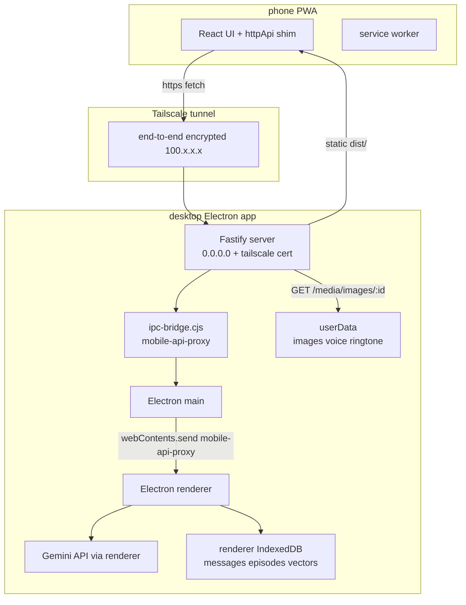
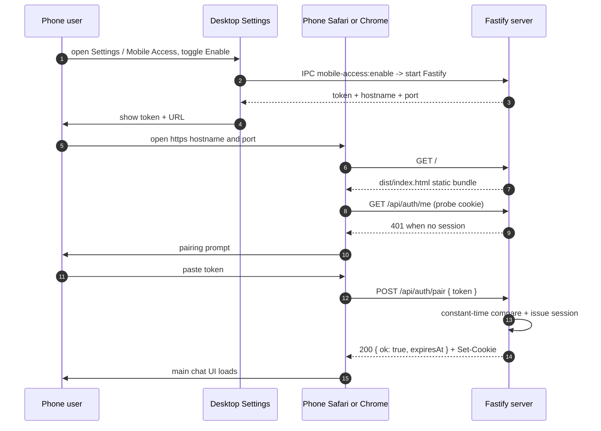

# Mobile Remote Access Architecture

This note documents how the desktop Kumiko·Amadeus process exposes itself
to a phone PWA over a private Tailscale tunnel. It is the source of truth
for anyone touching the `electron/server/` tree, the `mobile-api-proxy`
IPC channel, or the pairing token flow.

Scope: the phone-side remote access story only. Backup architecture is
separate — see [backup-architecture.md](./backup-architecture.md). RAG
vector store internals — see [rag-architecture.md](./rag-architecture.md).

## Deployment model: distributed, not SaaS

Kumiko·Amadeus is shipped as a desktop app each user installs locally.
There is no Kumiko-run cloud. Phone access is layered on top of the same
desktop install: each user's desktop becomes their personal backend, and
the phone is a thin client that talks to it directly.

Consequences baked into this design:

- **Data never leaves the user's PC**. `userData/images`, Dexie messages,
  and the SQLite RAG store all stay on the desktop machine.
- **API keys stay on the desktop**. The phone never holds a Gemini /
  OpenAI / other provider credential.
- **Desktop must be running** for the phone to do anything useful. This
  is accepted scope — the app needs network anyway for LLM calls, so
  "desktop offline = phone offline" is not a new limitation.
- **Tailscale is the transport**. Users install Tailscale on both ends
  (free for personal, 3 devices), the phone reaches the desktop via a
  `100.x.x.x` MagicDNS hostname, and the tunnel is end-to-end encrypted.

## 5-phase rollout (this file tracks Phase 1)

- **Phase 1 (current)**: HTTP + WebSocket server skeleton, Tailscale
  HTTPS cert wiring, pairing token auth, one end-to-end smoke route
  (`POST /api/chat`, `GET /api/messages/recent`, `GET /media/images/:id`).
- Phase 2: wire the remaining ~37 IPC channels through the same bridge,
  enable live WebSocket fan-out so desktop and phone UIs stay in sync.
- Phase 3: Web Push via APNs (iOS 16.4+) and FCM (non-CN Android) so
  system-level notifications arrive when the PWA is closed.
- Phase 4: Capacitor Android wrapper with aggregated vendor push
  (友盟/极光) to cover MIUI / HyperOS / HarmonyOS / ColorOS / OriginOS
  devices whose vanilla FCM path is unreliable in mainland China.
- Phase 5: responsive UI polish on every panel, pairing QR-code wizard,
  end-user Tailscale onboarding doc, release flow updates.

## Phase 1 architecture

### Why the renderer is in the path

Dexie lives in the Electron renderer process (IndexedDB under Chromium
storage). Message history, images metadata, RAG vectors, episodes, and
psyche state all route through Dexie. The Fastify server runs in main,
so mobile HTTP requests that need Dexie-backed data go main →
`webContents.send('mobile-api-proxy', ...)` → renderer → back to main →
HTTP response. Round-trip overhead is a single IPC hop, typically
under 20ms on desktop.

Alternative design (move Dexie data into main's SQLite) would be
architecturally cleaner but is a 2-3 week refactor with non-trivial
migration risk. Deferred.

## Components created in Phase 1

All live under `electron/server/` except the renderer-side shim:

- [electron/server/fastify-server.cjs](../electron/server/fastify-server.cjs) —
  Fastify 5.x instance. Binds `0.0.0.0` at a user-configurable high
  port (persisted in userData), registers static serve for `dist/`,
  WebSocket, auth, pairing, API bridge, and media routes. Stops
  gracefully on `before-quit`.
- [electron/server/tailscale-cert.cjs](../electron/server/tailscale-cert.cjs) —
  detects the `tailscale` CLI, runs `tailscale cert <hostname>` to obtain
  Let's Encrypt certs, watches for the 90-day renewal window, and exposes
  the current cert / key file paths to the Fastify boot routine. Returns
  a structured error when Tailscale is not installed so the UI can
  surface a "please install Tailscale" hint.
- [electron/server/auth.cjs](../electron/server/auth.cjs) — generates,
  verifies, and rotates the pairing token. Token is a 256-bit random
  string persisted under `userData/mobile-access.json` (mode 0o600 on
  Linux). Verified via constant-time compare. Pairing endpoint
  (`POST /api/auth/pair`) is rate-limited to 5 attempts / IP / minute.
  On success issues an `HttpOnly; Secure; SameSite=Strict` cookie with
  a 90-day expiry; subsequent requests auth against the cookie.
- [electron/server/ipc-bridge.cjs](../electron/server/ipc-bridge.cjs) —
  generic HTTP → `webContents.send('mobile-api-proxy', { requestId,
  channel, args })` → renderer → `ipcRenderer.send('mobile-api-proxy-
  reply', { requestId, result })` → main → HTTP response. First batch
  wired: `ping`, `chat`, `messages:recent`. Phase 2 extends the same
  mechanism to the full IPC surface.
- [electron/server/media-routes.cjs](../electron/server/media-routes.cjs) —
  `GET /media/images/:id` reads `userData/images/{id}.{ext}` using
  `findImageFile` from [electron/media-files.cjs](../electron/media-files.cjs).
  Sends `Cache-Control: private, max-age=86400` plus an `ETag` so
  service worker and browser cache both kick in. Voice / ringtone
  routes land in Phase 2.

Renderer side:

- [services/environment.ts](../services/environment.ts) — reports
  whether the current page is running inside Electron (via the
  `window.__KUMIKO_ENV__` sentinel injected by preload) or as a PWA on
  the phone. Also surfaces the API base URL derived from
  `window.location` when remote.
- [services/httpApi.ts](../services/httpApi.ts) — thin HTTP client for
  PWA builds. Exposes `httpInvoke(channel, args)` mirroring the
  `electronAPI.invoke(channel, data)` contract, plus `httpPair`,
  `httpLogout`, `httpStatus`, `httpCheckSession`, and `getHttpImageUrl`
  helpers. Sends `credentials: 'include'` on every call so the session
  cookie rides along. Live-push events (the `on` / `send` entry points
  electronAPI exposes) are Phase 2 work on the WebSocket surface — the
  shim intentionally doesn't stub them in Phase 1 so callers that need
  them fail loudly.
- [components/app/useMobileApiProxy.ts](../components/app/useMobileApiProxy.ts) —
  subscribes to `mobile-api-proxy` IPC on the Electron renderer and
  handles `ping`, `chat`, `messages:recent` by invoking the same
  services the Electron UI already uses. Keeps renderer code paths
  single-sourced; the phone simply triggers what the desktop would
  have triggered itself.
- [components/settings/MobileAccessSection.tsx](../components/settings/MobileAccessSection.tsx) —
  the desktop-only Settings panel entry that shows the enable toggle,
  the current Tailscale MagicDNS hostname, the pairing token (with a
  reveal / copy / rotate action), and a guide linking to Tailscale
  download if the CLI is missing.

## Pairing flow

## Security considerations

- **Transport**: HTTPS only. Fastify never binds a plain-text port.
  Certificate material comes from Tailscale's Let's Encrypt chain so
  iOS Safari accepts it without user warnings.
- **Authentication**: pairing token is a 256-bit random value. Failed
  pair attempts are rate-limited (5/IP/min). The post-pair cookie is
  `HttpOnly; Secure; SameSite=Strict`, 90-day TTL, scoped to the
  Tailscale hostname.
- **Authorization surface**: Phase 1 exposes only three business
  routes (`ping`, `chat`, `messages:recent`) and one media route
  (`/media/images/:id`). The `images:*` path is read-only; writes land
  in Phase 2 with per-route validation.
- **Secret handling**: API keys stay in the Electron main / renderer
  environment. The phone never receives provider credentials — chat
  requests are proxied through the renderer's `callLLMRaw` in Phase 1
  (and the full `sendMessageToGemini` pipeline in Phase 2).
- **Backup exclusion**: `userData/mobile-access.json` is explicitly
  excluded from the auto-zip / manual backup payload. Tokens rotate
  with the device, not with a data migration.

## Operational notes

- **Windows Defender firewall**: first launch of the server triggers
  the native prompt. The NSIS installer gains a dedicated inbound rule
  in Phase 5 so new installs don't block on the dialog.
- **Tailscale missing**: `tailscale-cert.cjs` reports `code: 'E_NO_CLI'`
  if the binary is not on `PATH`. `MobileAccessSection` surfaces a
  clear message plus a link to `https://tailscale.com/download`.
- **Cert renewal**: Let's Encrypt certs are 90 days. A 6-hour timer in
  `tailscale-cert.cjs` re-runs `tailscale cert` once the cert has under
  30 days remaining, writing new `.crt` + `.key` material to userData.
  Phase 1 logs the renewal and leaves the live Fastify instance with
  the old material until the user restarts the app; proper TLS hot-swap
  lands in a later phase when we have real-world renewal data.
- **Desktop window close**: the existing tray / hide-on-close behaviour
  keeps the renderer process alive, which the IPC bridge depends on.
  Quitting the app stops the server cleanly via `app.on('before-quit')`.

## Explicit non-goals for Phase 1

- No Web Push. PWA-closed notifications land in Phase 3.
- No Capacitor native shell. Chinese Android vendors with unreliable
  FCM arrive in Phase 4.
- No responsive UI pass. The app still renders its desktop layout on
  phone viewports; Phase 5 retrofits each panel.
- No multi-client write sync. Opening the PWA and the desktop at the
  same time may show stale state until the next explicit fetch; WS
  fan-out arrives in Phase 2.
- No dedicated pairing QR code. Phase 1 ships with copy-paste; the
  camera-based QR scan lands in Phase 5 alongside the end-user guide.
