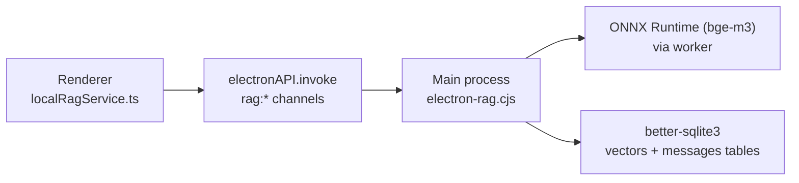
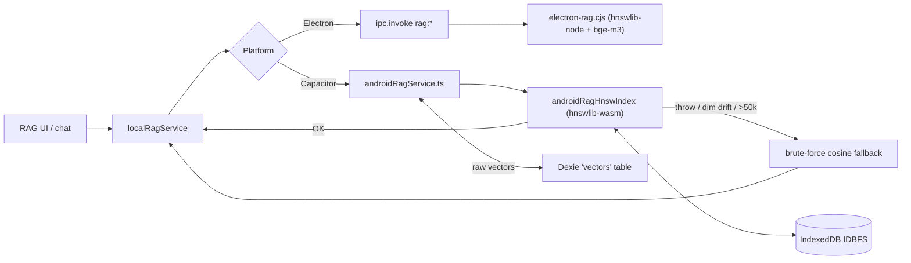

# RAG Architecture

Kumiko·Amadeus runs a local-only semantic memory layer: embeddings and
vector search execute in the main process (Node + ONNX Runtime + SQLite);
the renderer never talks to a remote embedding API. This note is the
source of truth for the IPC boundary, the SQLite schema, and the
`vectors` table evolution across Dexie versions.

Scope: RAG only. Backup file format / data.json layout is separate — see
[backup-architecture.md](./backup-architecture.md).

## Process split



The renderer holds app state (Zustand store + Dexie `db.vectors` mirror);
the main process holds the authoritative vector index (SQLite) and the
ONNX session. Every recall query round-trips through IPC.

## IPC surface (`rag:*` channels)

Registered in [`electron-rag.cjs`]; all exposed to the renderer through the
allowlist in [`preload.cjs`].

| Channel                          | Direction  | Purpose                                                                                              |
| -------------------------------- | ---------- | ---------------------------------------------------------------------------------------------------- |
| `rag:embed`                      | RND → MAIN | Generate a bge-m3 embedding for a single string. Used by the live-chat turn-pair recall path.        |
| `rag:save`                       | RND → MAIN | Persist one or more `VectorEntity` rows (text + vector + metadata) to SQLite.                        |
| `rag:search`                     | RND → MAIN | Grouped recall. Accepts `{ query, topK, startTime?, endTime?, role?, memoryIntent?, keywords? }`.    |
| `rag:expand-context`             | RND → MAIN | Temporal neighborhood fetch around a given timestamp.                                                |
| `rag:sync-messages`              | RND → MAIN | Mirror the renderer's Dexie `messages` table into SQLite. Used as evidence source during rebuild.    |
| `rag:get-messages`               | RND → MAIN | Read back the SQLite mirror. Merged with Dexie in `rawHistorySync.loadRawHistoryMessages`.           |
| `rag:get-all`                    | RND → MAIN | Full vector dump; used by `handleExportBackup` to stamp `vectors` into `data.json`.                  |
| `rag:restore`                    | RND → MAIN | Bulk-write vectors from a backup. Returns a structured result surfacing partial failures.            |
| `rag:clear-all`                  | RND → MAIN | Wipe the vectors table. Used by the "rebuild" path before repopulating.                              |
| `rag:clear-message-vectors`      | RND → MAIN | Latent per-message cleanup; no renderer wrapper yet (see comment in `preload.cjs`).                  |
| `rag:rebuild:start`              | RND → MAIN | Kick off the background rebuild worker.                                                              |
| `rag:rebuild:status`             | RND → MAIN | Poll current rebuild progress (stage + processed/total + counts).                                    |
| `rag:rebuild:{started,progress,done,error}` | MAIN → RND | Progress push channels consumed by the memory panel UI.                                 |
| `rag:stats`                      | RND → MAIN | Snapshot counters: vector count by tier, HNSW index size, grouped / merged counts.                    |
| `rag:status`                     | RND → MAIN | Lightweight readiness probe (model loaded? DB opened?).                                              |

Renderer side wrappers live in [`services/localRagService.ts`]. Every one
asserts `window.electronAPI` before invoking and throws a precise error
when the IPC is unavailable — RAG has no remote fallback on purpose.

## Embedding model

- Runtime: `onnxruntime-node` in a dedicated Worker (see
  `ensureRagWorker` / `callRagWorker` in [`electron-rag.cjs`]).
- Model: bge-m3 ONNX. Loaded from `userData/{rag-model}`; the installer
  stages the model into the user-data dir on first run.
- Fallback: if the worker fails to boot, `generateEmbeddingInMainProcess`
  runs the model directly in the main thread. This is slower and blocks
  the UI more aggressively, but it keeps the app usable on systems with
  worker-thread constraints.
- Retry: `localRagService.generateEmbedding(text, retries, backoff)` does
  an exponential-backoff retry loop in the renderer before giving up.
  The `aiConfig` parameter that used to precede `retries` was removed in
  an earlier commit (the RAG path is fully local, so the old remote-provider
  config surface had no meaning here).

## SQLite schema (`vectors` table)

```sql
CREATE TABLE IF NOT EXISTS vectors (
  id TEXT PRIMARY KEY,
  message_id TEXT,
  text TEXT,
  vector BLOB,
  timestamp INTEGER,
  tags TEXT,               -- JSON array
  tier TEXT,               -- 'core' | 'episodic' | 'background' | 'lore'
  source TEXT,             -- rebuild_message | rebuild_fragment | turn_pair | ...
  score REAL,
  canonical_key TEXT,
  role TEXT                -- 'user' | 'model' | 'system' | 'mixed' | 'unknown'
);
CREATE INDEX idx_vectors_timestamp ON vectors(timestamp);
CREATE INDEX idx_vectors_tier_timestamp ON vectors(tier, timestamp);
CREATE INDEX idx_vectors_canonical_key ON vectors(canonical_key);
```

There is also a parallel `messages` table that mirrors the renderer's
Dexie `messages` rows (see `upsertRawMessages` in [`electron-rag.cjs`]),
used during rebuild to derive fresh embeddings without round-tripping
through IndexedDB.

## Dexie `vectors` store evolution

The renderer keeps a Dexie-side mirror of the vector store so that the
memory panel can render synchronously without IPC. The schema lives in
[`services/db.ts`]; only the entries relevant to RAG are listed here.

| Dexie version | `vectors` schema                                                    | Notes                                                                 |
| ------------- | ------------------------------------------------------------------- | --------------------------------------------------------------------- |
| V1            | `id, timestamp`                                                     | Original minimal shape.                                               |
| V2            | `id, timestamp, *tags`                                              | Hybrid search: multi-entry `tags` index for keyword pre-filter.       |
| V3            | `id, timestamp, tier, source, canonicalKey, *tags`                  | `tier` / `source` / `canonicalKey` metadata for the fallback paths.    |
| V4            | (unchanged)                                                         | V4 added `episodes`; vectors schema frozen.                            |
| V5            | (unchanged)                                                         | Episode payload shape change; vectors frozen.                          |
| V9            | (unchanged)                                                         | V9 added diary / fragment / psyche tables; vectors frozen.             |
| V10 / V11     | (unchanged)                                                         | V10 added `imageId` index on `messages`; V11 dropped legacy `image`.  |

V6 / V7 / V8 were the retired GraphRAG experiment (entity-relation tables,
nothing to do with vectors) and were cleaned out of the schema history in
Plan 14 Phase D — Dexie version numbers are now non-contiguous (5 → 9)
which is supported.

## When to use Dexie direct vs IPC

- **Dexie direct** (`db.vectors.*`): renderer-only reads of the mirrored
  index. Memory panel rendering, search-result annotations on the client
  side. Do NOT write vectors directly to Dexie — the SQLite store is
  authoritative.
- **IPC** (`rag:*`): anything that generates embeddings, persists new
  vectors, or drives a search query. Writes always land in SQLite first,
  then the renderer decides whether to refresh its Dexie mirror.

Writing vectors directly to Dexie from the renderer would desync the
mirror from SQLite and leak incorrect vectors into subsequent searches
(since the search still goes through SQLite, but the mirror shows the
renderer's state). If you need to add a new vector source, extend
`rag:save` in [`electron-rag.cjs`] rather than growing a second writer.

## Rebuild lifecycle

Triggered by the user from the memory panel, handled by
`rag:rebuild:start`. Stages push through `rag:rebuild:progress` in this
order (see `LocalRagRebuildStage` in [`services/localRagService.ts`]):

1. `loading_source_history` — Read messages + fragments from Dexie.
2. `grouping_fragments` — Canonicalize and deduplicate by `canonicalKey`.
3. `generating_embeddings` — Run bge-m3 in batches (worker if available).
4. `writing_sqlite_rows` — Persist new vectors to SQLite.
5. `building_indexes` — Rebuild the in-memory HNSW accelerator for fast
   top-K search at query time.
6. `finalizing_statistics` — Update vector / grouped / merged counts
   exposed via `rag:stats`.

Partial failures during rebuild (a single row fails to embed, for example)
do not abort the job; they accumulate in the `filteredCount` /
`duplicateCount` counters and surface in the final status payload. The
job ID is random per start so overlapping rebuild requests are detectable.

## Android (Capacitor) RAG path

The Android APK ships without a Node main process and without `hnswlib-node`
/ `better-sqlite3`. The renderer-side code path is the same `localRagService`
invoker, but the platform branch routes to
[`services/androidRagService.ts`] instead of Electron IPC.



### Storage

| Layer | Library | Persisted in | Holds |
| --- | --- | --- | --- |
| Raw vectors | Dexie (IndexedDB) | App-private IDB | `VectorEntity` rows: `{ id, text, vector: Float32Array, timestamp, tier?, source?, canonicalKey?, tags? }` |
| HNSW index | `hnswlib-wasm` | Emscripten IDBFS file `kumiko-rag.hnsw` | Approximate-NN graph, label↔vector map sidecar |
| HNSW metadata | Dexie `keyval` | App-private IDB | `rag.hnsw.dim`, `rag.hnsw.idMap`, `rag.hnsw.savedAt` |

The Dexie `vectors` table is always authoritative — the HNSW index is a
search accelerator that we can drop and rebuild from Dexie at any time.

### Embedding model

Cloud-only: [`services/cloudEmbeddingService.ts`] dispatches to OpenAI,
Gemini, Zhipu GLM, Tongyi Qianwen, or BGE-Cloud per the user's
`EmbeddingProviderConfig`. Default is Gemini text-embedding-004 (768d).
There is no on-device ONNX runtime on Android; the bge-m3 path that
Electron uses is not packaged into the APK.

### HNSW index parameters

- Space: `cosine` (matches the brute-force fallback's similarity metric).
- M = 32, `efConstruction` = 200, `efSearch` = 64.
- Initial capacity = `max(10 000, vectorCount × 2)`; we `resizeIndex` on
  the fly (doubling) up to `HNSW_MAX_ELEMENTS` = 50 000.

### Failure modes & graceful degradation

Every entry point in [`services/androidRagHnswIndex.ts`] is wrapped in a
try/catch that flips a module-level `mode` flag from `'hnsw'` to
`'bruteforce'`. The brute-force path in [`services/androidRagService.ts`]
(`bruteForceSearch`) is always available because it reads directly from
Dexie. Triggering conditions:

| Trigger | Detection | Recovery |
| --- | --- | --- |
| `hnswlib-wasm` module load fails | Dynamic import throws | Fall back permanently for this session; brute force serves searches |
| Vector count > 50 000 at init | `db.vectors.count()` check | Skip HNSW load, brute force |
| Embedding dim drift (provider switch) | Compare `keyval.rag.hnsw.dim` vs current `getEmbeddingConfig().dimensions` | Mark needsRebuild, fall back this session, prompt user via "Rebuild RAG memory" button |
| `readIndex` throws (corrupt IDBFS file) | Try/catch around `readIndex` | Drop in-memory index, mark needsRebuild, brute force |
| `searchKnn` throws | Try/catch around `hnsw.search` | Per-query fall back to brute force, do not poison module |
| Deleted ratio > 30 % | `markDelete` counter | Mark needsRebuild; user can trigger rebuild from settings |

### Rebuild flow on Android

Triggered the same way as on Electron (the "重建 RAG 记忆库" button in
`RagConfigSection`). The handler short-circuits in
[`services/androidRagService.ts`]:

1. Drop the HNSW index + IDBFS file.
2. Re-init empty at `max(10 000, vectorCount + 1024)` capacity.
3. Stream Dexie rows in 200-row batches via `db.vectors.offset(c).limit(200)`,
   inserting each batch with `hnsw.addBatchFresh`. After each batch we
   `await new Promise(setTimeout(0))` so the UI stays responsive.
4. `flush()` writes the index back to IDBFS and persists the label map.

Capacitor has no IPC event channel, so progress is queryable via the
`rag:rebuild:status` channel. The renderer's `subscribeLocalRagRebuild`
polls every 300 ms on Capacitor and synthesises the same
`started → progress → done | error` event sequence the Electron IPC
branch emits, so the upstream UI (memory panel rebuild progress) is
platform-agnostic.

### What we DO NOT rebuild on Android

- We never re-embed text. The cloud embedding round-trip would be
  punitive (5 providers × thousands of rows × ~500 ms each). Dexie
  already has the raw vectors so we reuse them as-is.
- We do not rebuild episodes / fragments / lore. Those flow through
  their own pipelines that already write into Dexie + `rag:save`.
- We do not rebuild a SQLite mirror — there isn't one.
